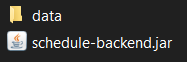

# schedule-back

1. This project needs Jre 11.
2. Go to the jar package folder via command line and then run `java -jar schedule-backend.jar` for a local deployment.
3. Navigate to http://localhost:8090/api/api-docs-ui.html to view the documentation.
4. **Optional** To create a new jar package run `gradle build` with your IDE.
5. Download `data` folder, and the content `schedule_db.mv.db` to manipulate the data. Must be placed in the same folder with the jar.

